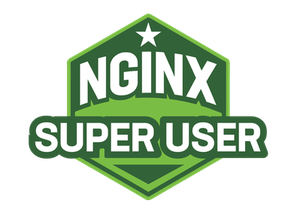

# Developer Portal Configuration
In the previously created *API Connectivity Manager*-> *Infrastructure*-> *Workspace*-> *Environment*. Inside the environment (*nonprod*), Create Developer Portal Cluster. 

### Create Configuration
`1.` The name of the Dev Portal Clusters must be same with the instance group (refer to the *Instance Manager*-> *Instance Group*) name you specify in this case "*devportal*". 
 
 Enter *devportal* into `Name` field, and enter *nginx-devportal* into `Hostname` field. Click `Create` button to create Developer Portal. 
 

`2.` Once done, go to *Services*-> select the *httpbin-api* API proxy, Click *Edit Proxy*. Under *Configuration*, Look for *Developer Portal*, Tick the checkbox “*Also publish API to developer portal*”, and provide a portal proxy hostname value (*nginx-devportal*), Click `Save & Publish` button to complete. 
 

### Enable Access
`3.` Go to your UDF lab portal, create additional access method under ubuntu server for port 90. 
Enter *HTTP-90* into `Label` field, select *HTTPS* on `Protocol` dropdown, select *10.1.1.6* on `Instance Address` dropdown, and enter *90* into `Instance Port` field, click Save button to complete. 
 
 Once done, locate the newly added access method with port 90 and click `Access` to browse Developer Portal. 

### Explore Developer Portal
`4.` Spend 2-3 minutes to explore Developer Portal. Look for various endpoints and possible API calls. 
 

### The End
Thank you for your time for NGINX Super User 2.0 Lab 103, untill the next time, have a good one! 
 
